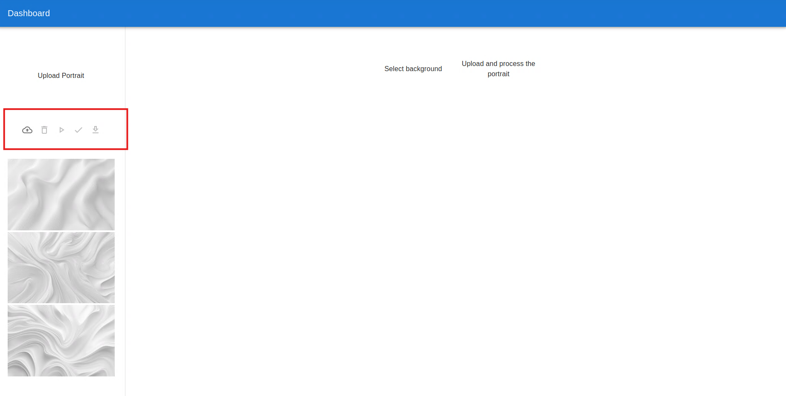

# Portrait Processing Image

## Install
1. **Backend** 
   - Install pyenv and Python 3.10 by following this [link](https://github.com/pyenv/pyenv?tab=readme-ov-file#installation)
     ```shell
     pyenv install 3.10.13
     ```
   - Prepare the virtual env
     ```shell
     pyenv virtualenv 3.10.13 admind.test
     ```
   - Install Requirements
     ```shell
     pyenv activate admind.test
     pip install -r requirements.txt
      ```
2. **Frontend**
   - Install Node 20.
     - If you don't have node 20, please install nvm by following this [link](https://github.com/nvm-sh/nvm?tab=readme-ov-file#installing-and-updating)
     - Once you install the nvm, please run following command.
       ```shell
       nvm install 20
       ```
   - Install node modules
     ```shell
     nvm use 20
     npm i -g yarn
     yarn install
     ```
   - Build
     ```shell
     nvm use 20
     npm i -g yarn
     yarn build
     ```

## Run the project
- Please run the following command at the project level
  ```shell
  nvm use 20
  yarn build
  ```
- Run the backend
  ```shell
  pyenv activate admind.test
  fastapi run
  ```
- Open the [http://localhost:8000](http://localhost:8000)

## Result
- Here are demo
  - IMAGE
    
  - VIDEO
    - [Watch Demo](./demo/demo-admind.mp4)
